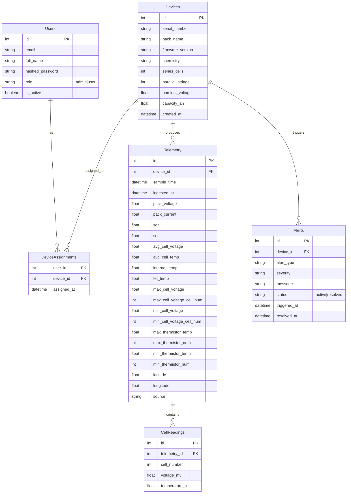

# Data Model

The BMS Analytics application uses a normalized SQL data model managed via SQLAlchemy (backend) and presented dynamically via React (frontend).

## Schema Overview

## Description of Entities

1. **Users:** Manages authentication and roles (`admin` vs `user`). Admins have access to the entire fleet; users can only view devices explicitly assigned to them via `DeviceAssignments`.
2. **Devices:** Represents physical battery packs or devices out in the field. Stores immutable configuration like chemistry, capacity, and cell counts.
3. **DeviceAssignments:** A many-to-many link granting a `user` scoped read-access to a specific `device`.
4. **Telemetry:** Represents a single point-in-time snapshot of the overall pack state (pack voltage, SOC, SOH, current, max/min cell values). For storage efficiency, detailed cell-by-cell data is offloaded.
5. **CellReadings:** Per-cell granular data (voltage and temperature) connected to a specific telemetry snapshot. These can grow very large and are selectively queried (e.g. for the 3D pack viewer).
6. **Alerts:** Anomalies and alerts generated by the ingestion pipeline (e.g. over-temperature, voltage imbalance).
